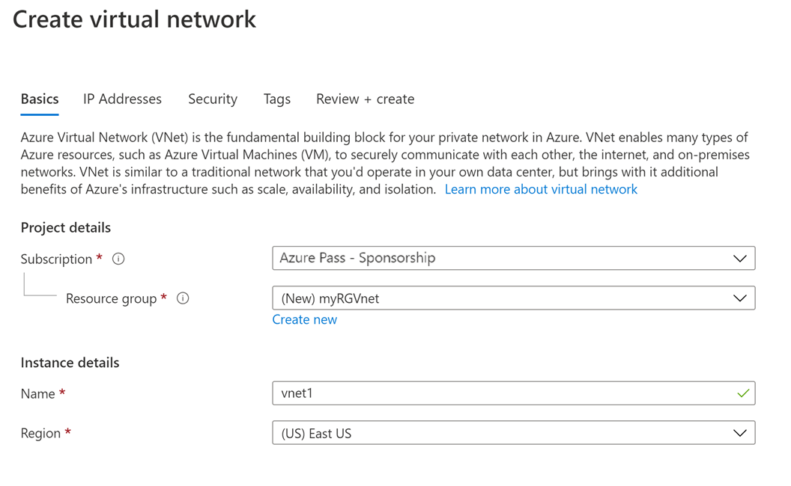
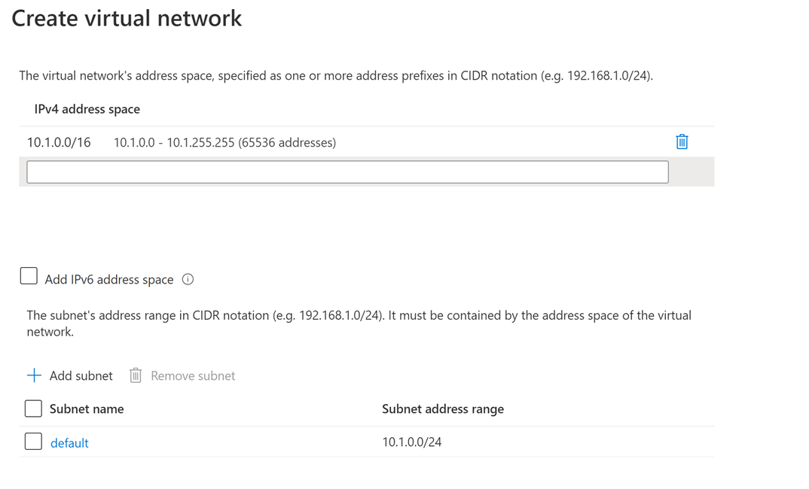

---
wts:
    title: '04 - Create a virtual network (20 min)'
    module: 'Module 02 - Core Azure Services (Workloads)'
---
# 04 - Create a virtual network

In this walkthrough, we will create a virtual network, deploy two virtual machines onto that virtual network and then configure them to allow one virtual machine to ping the other within that virtual network.

# Task 1: Create a virtual network (20 min)

In this task, we will create a virtual network. 

1. Sign in to the Azure portal at <a href="https://portal.azure.com" target="_blank"><span style="color: #0066cc;" color="#0066cc">https://portal.azure.com</span></a>

2. From the **All services** blade, search for and select **Virtual networks**, and then click **+ Create**. 

3. On the **Basics** tab, fill in the following information (leave the defaults for everything else):

    | Setting | Value | 
    | --- | --- |
    | Subscription | Leave default provided |
    | Resource Group | Select default provided in drop down |
    | Name | **vnet1** |
    | Region | **(US) East US** |
    
   
4. Click the **Review + create** button. Ensure the validation passes.


REMOVE
3. On the **Create virtual network** blade, fill in the following (leave the defaults for everything else):
    
    | Subnet - Name | **default** |
        | Address space |**10.1.0.0/16** |
    | Subnet Address range | **10.1.0.0/24** |

    
    


   Click the **Review + create** button. Ensure the validation passes. 

6. Click the **Create** button to deploy the virtual network. 

    **Note**: In your organization, how will you know which virtual networks and IP addressing you will need?
    REMOVE

# Task 2: Create two virtual machines

In this task, we will create two virtual machines in the virtual network. 

1. From the **All services** blade, search for **Virtual machines** and then click **+ Add**, from the drop down select **Virtual Machine**. 

2. On the **Basics** tab, fill in the following information (leave the defaults for everything else):

   | Setting | Value | 
   | --- | --- |
   | Subscription | Use default provided |
   | Resource group |  Select default from drop down |
   | Virtual machine name | **vm1**|
   | Region | **(US) East US** |
   | Image | **Windows Server 2019 Datacenter Gen1** |
   | Username| **azureuser** |
   | Password| **Pa$$w0rd1234** |
   | Public inbound ports| Select **Allow selected ports**  |
   | Selected inbound ports| **RDP (3389)** |
   |||

3. Select the **Networking** tab. Make sure the virtual machine is placed in the vnet1 virtual network. Review the default settings, but do not make any other changes. 

   | Setting | Value | 
   | --- | --- |
   | Virtual network | **vnet1** |
   |||

4. Click **Review + create**. After the Validation passes, click **Create**. Deployment times can vary but it can generally take between three to six minutes to deploy.

5. Monitor your deployment, but continue on to the next step. 

6. Create a second virtual machine by repeating steps **2 to 4** above. Make sure you use a different virtual machine name, that the virtual machine is within the same virtual network, and is using a new public IP address:

    | Setting | Value |
    | --- | --- |
    | Resource group | **myRGVNet** |
    | Virtual machine name |  **vm2** |
    | Virtual network | **vnet1** |
    | Public IP | (new) **vm2-ip** |
    |||

7. Wait for both virtual machines to deploy. 

# Task 3: Test the connection 

In this task, we will allow ICMP connections and test whether the virtual machines can communicate (ping) each other. 

1. From the **All resources** blade, search for **vm1**, open its **Overview** blade, and make sure its **Status** is **Running**. You may need to **Refresh** the page.

2. On the **Overview** blade, click the **Connect** button.

    **Note**: The following directions tell you how to connect to your VM from a Windows computer. 

3. On the **Connect to virtual machine** blade, keep the default options to connect by IP address over port 3389 and click **Download RDP File**.

4. Open the downloaded RDP file and click **Connect** when prompted. 

5. In the **Windows Security** window, type the username **azureuser** and password **Pa$$w0rd1234** and then click **OK**.

6. You may receive a certificate warning during the sign-in process. Click **Yes** or to create the connection and connect to your deployed VM. You should connect successfully.

7. Open up a PowerShell command prompt on the virtual machine, by clicking the **Start** button, typing **PowerShell**, right clicking **Windows PowerShell** in the right-click menu, and clicking **Run as administrator**

8. Try to ping vm2 by typing **ping vm2** (make sure vm2 is running). You will receive an error, saying request timed out.  The `ping` fails, because `ping` uses the **Internet Control Message Protocol (ICMP)**. By default, ICMP isn't allowed through the Windows firewall. 

   ```PowerShell
   ping vm2
   ```

   
   
    **Note**: You will now open an RDP session to vm2 and allow incoming ICMP connections. Grab the Blue bar in the center of vm1 to move the virtual machine window, you need to access the Azure Portal.

9. Search for vm2 in under resources. In the Overview screen, connect to **vm2** using RDP. You can follow steps **2 to 7**.

10. In Powershell, at the prompt enter the following command tehn press enter:

   ```PowerShell
   New-NetFirewallRule –DisplayName “Allow ICMPv4-In” –Protocol ICMPv4
   ```
   
   
   This command allows ICMP inbound connections through the Windows firewall.

11. Return to the RDP session for vm1 and try the ping again. You should now be successful. 

   ```PowerShell
   ping vm2
   ```

Congratulations! You have configured and deployed two virtual machines in a virtual network. You have also configured the Windows firewall so one of the virtual machines allows incoming ping requests. 

**Note**: To avoid additional costs, you can remove this resource group. Search for resource groups, click your resource group, and then click **Delete resource group**. Verify the name of the resource group and then click **Delete**. Monitor the **Notifications** to see how the delete is proceeding.
