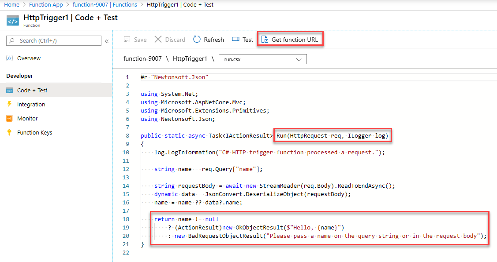

---
wts:
    title: '07 - Implement Azure Functions'
    module: 'Module 02 - Core Azure Services'
---
# 07 - Implement Azure Functions

In this walkthrough, we will create a Function App to display a Hello message when there is an HTTP request. 

Estimated time: 30 minutes

# Task 1: Create a Function app

In this task, we will create a Function app.

1. Sign in to the [Azure portal](https://portal.azure.com).

2. Search for **Function App** and then click **+Add**.

3. Fill in the Azure Function App settings fields. If not specified, take the default. 

    | Settings | Value |
    | -- | --|
    | App name | **function-xxx** (this must be unique) |
    | Subscription | **Choose your subscription** |
    | Resource group | **myRGFunction** (Create new) |
    | Publish | **Code** |
    | Runtime stack | **.NET Core** |
    | Region | **East US** |
    | | |	

4. Select the **Review + Create** button and, after verification, select the **Create** button to begin provisioning and deploying your new Azure Function App.

5. Wait for the Notiication that the resource has been created.

6. **Refresh** the Function App page and verify your new resource is *running*. 

    

# Task 2: Create a HTTP triggered function and test

In this task, we will use the Webhook + API function to display a message when there is an HTTP request. 

1. Select your new Function app.

2. Select the "**+**" button next to **Functions**, and select **In-portal**. Notice your other choices for developing in Visual Studio and VS Code. Click **Continue**. 

    

3. Choose **WebHook + API**, and then select **Create**. This will run a function whenever the app receives an HTTP request. There are a large number of other templates to choose from.

    

4. Notice the code is designed to run an HTTP request and log information. Also, notice the function returns a Hello message with a name. 

    

5. Select **Get function URL** from the top of function editor. 

6. Set the **Key** drop-down value to **default (Function key)**. Then, select **Copy** to copy the function URL. 

    

7. Open a new browser tab and paste the copied function URL into your web browser's address bar. When the page is requested the function will run. Notice the message that the function needs a name. 

    

8. Append **&name=yourname** to the end of the URL. 

    **Note**: Here, `<yourname>` refers to your given first name. The final URL will be something like, `https://azfuncxxx.azurewebsites.net/api/HttpTrigger1?code=X9xx9999xXXXXX9x9xxxXX==&name=cindy`

    

9. When your function runs, trace information is written to log files in Azure. To view the logs in Azure portal, return to the function editor and, at the bottom of the page, select the **Logs** button.

     

    **Note**: If no log information was collected, retun to the browser tab where you pasted the function app URL, refresh the page and then return to the Logs tab.

Congratulations! You have created a Function App to display a Hello message when there is an HTTP request. 

**Note**: To avoid additional costs, you can remove this resource group. Search for resource groups, click your resource group, and then click **Delete resource group**. Verify the name of the resource group and then click **Delete**. Monitor the **Notifications** to see how the delete is proceeding.
